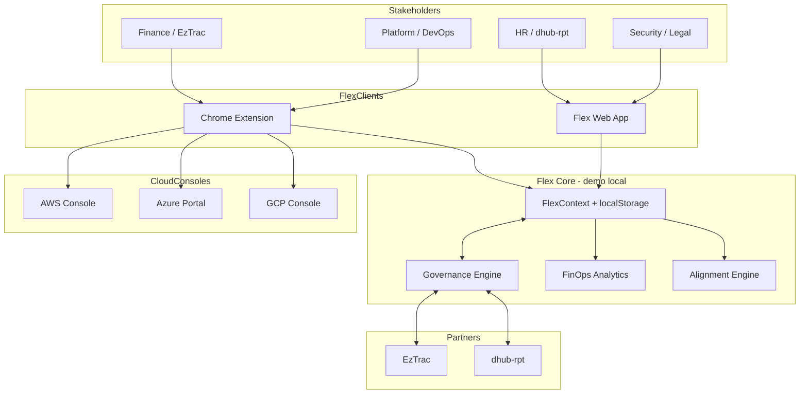

# Flex Platform — High-Level Design (HLD)

## 1. Executive summary

**Flex** is a cloud financial operations platform delivered as a **browser extension** and **embedded web application**. It unifies cloud spend, resource allocation, anomaly detection, and **governed data exchange** between Flex and partner systems:

| Application | Role | Users |
|-------------|------|-------|
| **EzTrac** | Finance forecasting | Finance, FP&A |
| **dhub-rpt** | Resource planning | HR, Platform, Capacity planning |
| **Flex** | System of engagement | FinOps, DevOps, Engineering leadership |

Flex v2.0 adds **cross-functional capabilities** for Finance, Cloud, DevOps, HR, and Governance — not just dashboards, but accountability, proof, and action.

---

## 2. Goals and scope

### In scope (demo / v2.0)

| Domain | Capability |
|--------|------------|
| **Finance** | Chargeback/showback, savings lifecycle (identified → realized), audit bundles |
| **Cloud / FinOps** | Usage analytics, optimization, anomaly stories, tag compliance |
| **DevOps** | Context-aware page chip on AWS/Azure/GCP consoles, deploy correlation |
| **HR / Planning** | Workforce × infrastructure matrix, hiring/reallocate signals |
| **Governance** | RBAC-lite, approval impact preview, field-level publish boundary, undo |
| **AI** | RAG assistant, intent command palette (⌘K), chat-to-action |
| **Extension** | Side panel, predictive badge, Slack approval demo, page sense |

### Out of scope (production backlog)

- Live AWS/Azure/GCP CUR ingestion APIs
- Enterprise SSO (OIDC) and multi-tenant isolation
- Real Slack/Teams OAuth webhooks
- ML training pipelines and data warehouse

---

## 3. System context

---

## 4. Logical architecture

| Layer | Responsibility |
|-------|----------------|
| **Presentation** | React SPA — 14 routes including Chargeback, Workforce, Alignment |
| **Extension shell** | MV3 service worker, content scripts (page sense), side panel, badge |
| **Application state** | `FlexContext` — requests, datasets, anomalies, savings, settings, audit log |
| **Governance** | RBAC, impact simulator, field boundary preview, hash-chained audit export |
| **Integration adapters** | EzTrac / dhub-rpt mock sync + Slack demo notifications |
| **AI layer** | RAG over Flex + partner knowledge; intent routing; executable actions |

---

## 5. Key capabilities (v2.0)

### 5.1 Chargeback & showback (`/chargeback`)
- Team-level spend vs budget vs EzTrac forecast
- Cost center and initiative mapping (Finance)
- Tag compliance score and untagged spend (DevOps)
- Cost per engineer metric (HR visibility)

### 5.2 Savings lifecycle (`/optimization`)
- Stages: **identified → approved → implementing → realized**
- Realization rate KPI for Finance proof
- Owner assignment per opportunity

### 5.3 Workforce × infrastructure (`/workforce`)
- Squad headcount vs dhub-rpt capacity vs Flex cloud cost
- Signals: **hire**, **reallocate**, **optimize**, **stable**
- Bridges HR planning and FinOps spend

### 5.4 Governance & RBAC
| Role | Can approve | Can publish |
|------|-------------|-------------|
| **Admin** | All | All |
| **Finance** | EzTrac inbound | Finance datasets |
| **Platform** | dhub-rpt inbound | Allocation / infra datasets |
| **Viewer** | None | None |

Additional controls:
- **Approval impact preview** — KPI/alignment delta before confirm
- **Field boundary preview** — schema classification before publish
- **8-second undo** — reversible governed actions
- **Audit bundle** — hash-chained JSON + markdown export

### 5.5 Anomaly incident stories (`/anomalies`)
- Timeline: detected → deploy correlation → transfer events → action → resolved
- Pulls from `transferLog` + demo deploy correlation

### 5.6 Extension intelligence
| Feature | Description |
|---------|-------------|
| **Page Sense** | Floating chip on AWS/Azure/GCP consoles → opens relevant Flex view |
| **Predictive badge** | Shows `3·$4K` risk-weighted pending count |
| **Intent palette (⌘K)** | Navigate, run actions, or pre-fill AI queries |
| **Slack demo** | Simulated approval notification on inbound sync |

### 5.7 Flex AI
- RAG over live KPIs, exchange state, partner knowledge
- **Chat-to-action** — propose approve/publish/resolve with undo
- Command palette routes natural-language intents to AI

---

## 6. Cross-stakeholder value map

| Stakeholder | Primary Flex views | Outcome |
|-------------|-------------------|---------|
| **Finance** | Chargeback, Optimization, Alignment, Audit export | Budget truth, savings proof, compliance |
| **Cloud / FinOps** | Dashboard, Cloud, Anomalies, Exchange | Waste removal, governed sharing |
| **DevOps** | Anomalies (stories), Page Sense, Resources | Deploy ↔ cost correlation |
| **HR** | Workforce, Alignment | Capacity vs headcount decisions |
| **Security / Legal** | Settings audit bundle, Field boundary | Data boundary proof |

---

## 7. Integration patterns

Unchanged from v1 — inbound approval gate, outbound dataset registry — now with:
- RBAC enforcement per partner app
- Slack notification on `refreshFromExternal` (demo)
- Impact simulation before approve
- Schema boundary before publish

---

## 8. Deployment view

| Component | Artifact | Host |
|-----------|----------|------|
| Flex App | Vite `dist/` | Bundled in `extensions/chrome/app/` |
| Extension | `extensions/chrome/` + content scripts | Chrome / Edge |
| Content scripts | `content/pageSense.js` | AWS/Azure/GCP console tabs |
| State | `localStorage` key `flex_state_v2` | Browser |

**Build:** `npm run build` → load unpacked `extensions/chrome/`

---

## 9. Non-functional requirements

| NFR | Demo | Production target |
|-----|------|-------------------|
| Security | RBAC-lite, field boundary | SSO + scoped API keys |
| Audit | Hash-chain demo bundle | Immutable store + HSM |
| Performance | Client-only, &lt; 3s load | API P95 &lt; 2s |
| UX | Undo, impact preview | Same + approval SLAs |

---

## 10. Technology stack

- React 18, TypeScript, Vite, Tailwind, Recharts, Lucide
- Chrome MV3 — side panel, content scripts, storage bridge
- State: React Context + localStorage

---

## 11. Roadmap

| Phase | Status | Focus |
|-------|--------|-------|
| **v1** | Done | Dashboard, exchange, extension shell |
| **v1.2** | Done | AI, alignment, insights, command palette basics |
| **v2.0** | **Current** | Chargeback, workforce, RBAC, audit, page sense, lifecycle |
| **v3** | Planned | Flex REST API, live cloud ingest, SSO |
| **v4** | Planned | Live EzTrac/dhub-rpt webhooks, ML anomalies |

---

*Document version: 2.0 — Flex FinOps Platform*
