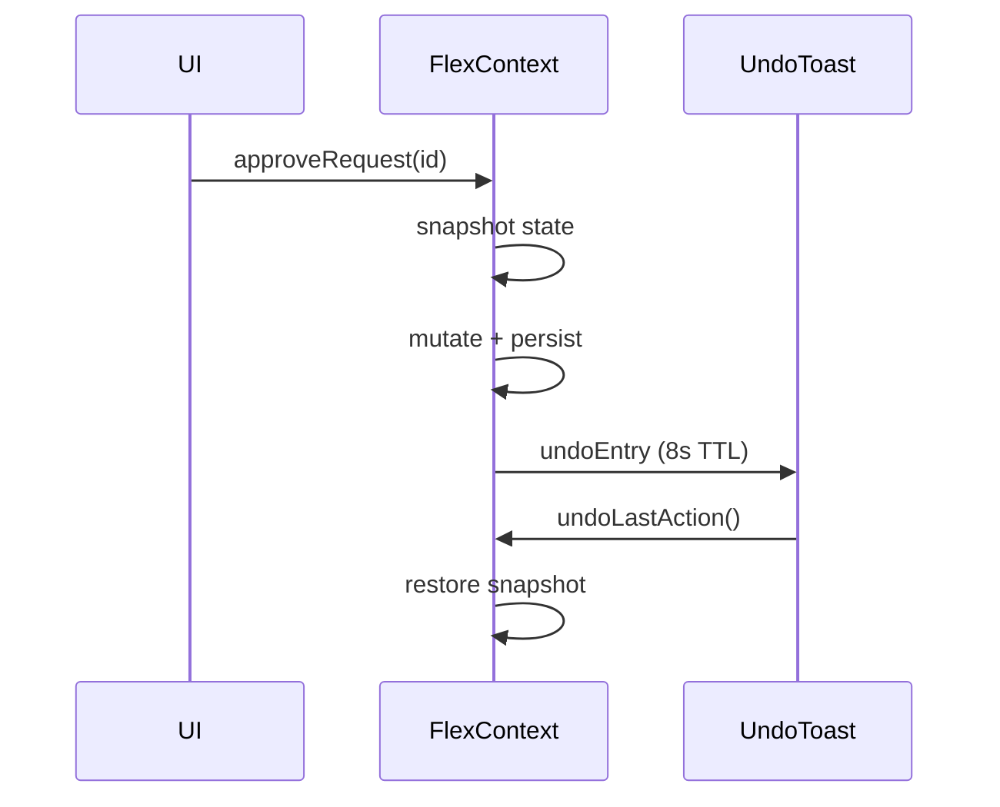
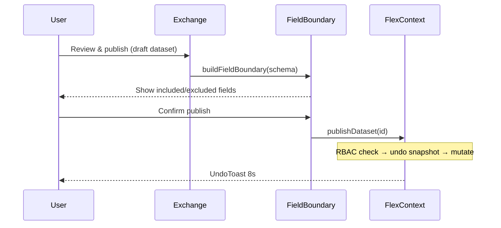

# Flex Platform — Low-Level Design (LLD)

## 1. Repository structure

```
flex-repo/
├── apps/
│   └── flex/                      # React FinOps SPA and global plugin host
│       ├── src/
│       │   ├── components/        # UI + modals (ApprovalImpact, FieldBoundary, UndoToast)
│       │   ├── pages/             # Route views (14 routes)
│       │   ├── store/             # FlexContext, flexTypes
│       │   ├── data/              # Mock datasets (chargeback, workforce, alignment, ...)
│       │   ├── lib/               # rbac, auditBundle, anomalyStory, commandIntent, ...
│       │   └── hooks/             # useRagChat, useExtensionNavigate
│       └── dist/                  # Vite build copied to Chrome extension
├── extensions/
│   ├── chrome/                    # Chrome MV3
│   │   ├── manifest.json          # v2.0 - content scripts, host permissions
│   │   ├── background.js          # Badge, notifications, panel routing
│   │   ├── content/               # Page Sense chip (AWS/Azure/GCP)
│   │   ├── popup/                 # Quick-view popup
│   │   └── app/                   # Bundled SPA (from apps/flex/dist)
│   └── vscode/                    # VS Code extension source
├── packages/
│   ├── flex-plugin-sdk/           # SDK consumed by EzTrac/dhub-rpt
│   └── plugin-manifests/          # Sample .flexext.json packages
├── services/
│   └── flex-api/                  # Local REST bridge for VS Code/Node demos
├── scripts/
│   ├── build-extension.js
│   └── generate-icons.js
└── docs/
    ├── HLD.md
    └── LLD.md
```

---

## 2. Domain model

### 2.1 Core entities

```typescript
type AppId = 'flex' | 'eztrac' | 'dhub-rpt';
type UserRole = 'admin' | 'finance' | 'platform' | 'viewer';
type SavingsStage = 'identified' | 'approved' | 'implementing' | 'realized';

interface FlexSettings {
  userRole: UserRole;
  slackApprovals: boolean;
}

interface FlexState {
  dataRequests: DataRequest[];
  publishedDatasets: PublishedDataset[];
  anomalies: Anomaly[];
  kpis: KpiSnapshot;
  transferLog: TransferLogEntry[];
  savings: SavingsOpportunity[];
  settings: FlexSettings;
}

interface ChargebackRow { team, costCenter, initiative, monthlySpend, budget, … }
interface SquadWorkforceRow { squad, headcount, capacityUsedPct, signal, … }
```

### 2.2 Persistence

| Key | Content |
|-----|---------|
| `flex_state_v2` | Full `FlexState` JSON |
| `flex_rag_chat_v1` | Chat sessions |
| `flex_snapshot` | Extension badge KPI mirror |

`normalizeState()` migrates older saves missing `savings` or `settings`.

---

## 3. Routing

| Path | Page | Stakeholder |
|------|------|-------------|
| `/` | Dashboard | All |
| `/alignment` | Cross-App Alignment | Finance, Platform |
| `/cloud` | Cloud Usage | FinOps |
| `/optimization` | Savings lifecycle | Finance, Cloud |
| `/chargeback` | Chargeback & showback | Finance, HR |
| `/workforce` | Workforce × infra | HR, Platform |
| `/resources` | Resource allocation | Platform |
| `/anomalies` | Anomalies + stories | DevOps, FinOps |
| `/exchange` | Data Exchange | Governance |
| `/integrations` | Partner sync | All |
| `/assistant` | Flex AI | All |
| `/settings` | RBAC, audit, exports | Admin, Security |

Router: `HashRouter`-compatible via Vite `base: './'` for extension.

---

## 4. State management (`FlexContext.tsx`)

### 4.1 Mutations (with RBAC + undo)

| Action | RBAC check | Undo |
|--------|------------|------|
| `approveRequest(id)` | `canApproveRequest(role, req)` | 8s snapshot |
| `rejectRequest(id)` | Same as approve | 8s |
| `publishDataset(id)` | `canPublishDataset(role, ds)` | 8s |
| `resolveAnomaly(id)` | `canResolveAnomaly(role)` | 8s |
| `advanceSavingsStage(id)` | None (demo) | No |
| `setUserRole(role)` | None | No |
| `refreshFromExternal(app)` | None | No (+ Slack demo) |

Returns `boolean` from governed mutations; sets `lastActionError` on RBAC deny.

### 4.2 Undo flow



---

## 5. Governance modules

### 5.1 Approval impact (`lib/approvalImpact.ts`)

Simulates before approve:
- Pending approvals, utilization, spend delta
- Alignment score change
- Stale downstream datasets

UI: `ApprovalImpactModal` on Data Exchange **Preview impact**.

### 5.2 Field boundary (`lib/fieldBoundary.ts`)

Maps dataset schema fields → classification (`public`, `internal`, `pii`).
Excludes PII from partner feed preview.

UI: `FieldBoundaryModal` on **Review & publish**.

### 5.3 Audit bundle (`lib/auditBundle.ts`)

Builds hash-chained event log from `transferLog` + resolved anomalies.
Exports JSON (full bundle) and markdown summary.

Demo signature: `FLEX-DEMO-SIG-{hash}` — production uses Ed25519/HSM.

### 5.4 RBAC (`lib/rbac.ts`)

```typescript
canApproveRequest(role, request):
  finance  → request.fromApp === 'eztrac'
  platform → request.fromApp === 'dhub-rpt'
  admin    → all
  viewer   → none
```

---

## 6. AI layer

### 6.1 RAG pipeline
`buildKnowledgeBase` ← live FlexState + partner mocks → `retrieveOrFallback` → `generateAnswer`

### 6.2 Chat-to-action (`lib/chatActions.ts`)
Detects intent from user query → attaches `ChatAction[]` to assistant message.
`ActionCards` component executes via `FlexContext` mutations (with undo).

### 6.3 Intent palette (`lib/commandIntent.ts`)
`searchPaletteItems(query)` scores:
- **Navigate** — pages including chargeback, workforce
- **AI** — pre-filled queries routed to `/assistant`
- **Action** — approve, publish feed, resolve critical

Extension-only: `CommandPalette` listens for ⌘K.

---

## 7. Extension layer

### 7.1 manifest.json (v2.0)

```json
{
  "version": "2.0.0",
  "permissions": ["storage", "sidePanel", "notifications", "tabs", "contextMenus"],
  "host_permissions": ["https://console.aws.amazon.com/*", "..."],
  "content_scripts": [{ "js": ["content/pageSense.js"], "matches": ["..."] }]
}
```

### 7.2 Page Sense (`content/pageSense.js`)

| URL pattern | Flex route |
|-------------|------------|
| AWS Cost Explorer / billing | `/cloud` |
| AWS EC2 | `/anomalies` |
| Azure portal | `/cloud` |
| GCP console | `/cloud` |

Chip click → `FLEX_OPEN_PANEL` + `flex_pending_route` in storage.

### 7.3 Predictive badge (`background.js`)

```javascript
// pending + spend → "3·$4K" estimated risk
formatRisk(snapshot) → `${pending}·$${riskK}K`
```

### 7.4 Message protocol

| Message | Direction | Effect |
|---------|-----------|--------|
| `FLEX_STATE_UPDATED` | app → bg | Update badge |
| `FLEX_NOTIFY` | app → bg | Desktop notification |
| `FLEX_OPEN_PANEL` | app/content → bg | Open side panel |
| `FLEX_NAVIGATE` | app → bg | Set pending route |

---

## 8. Data layer (demo)

| File | Purpose |
|------|---------|
| `mockData.ts` | KPIs, requests, datasets, anomalies |
| `chargeback.ts` | Team showback rows |
| `workforce.ts` | Squad × cost matrix |
| `tagCompliance.ts` | Tag coverage rules |
| `alignment.ts` | Cross-app comparison |
| `insights.ts` | Savings opportunities + stages |
| `partners/` | EzTrac + dhub-rpt RAG knowledge |

### Production data layer (planned)

```
Cost ingest (CUR) → Flex API → PostgreSQL/TimescaleDB
                              → Redis cache
                              → Webhook events (exchange.*, anomaly.*)
```

---

## 9. API sketch (future REST)

```
GET  /v1/chargeback?period=
GET  /v1/workforce/squads
GET  /v1/savings?stage=
GET  /v1/audit/bundle
POST /v1/exchange/requests/{id}/approve   # RBAC enforced server-side
POST /v1/webhooks/slack/approval
```

---

## 10. Security checklist

| Control | v2 Demo | Production |
|---------|---------|------------|
| RBAC | Client-side role switch | OIDC claims → roles |
| Audit | Demo hash chain | Append-only audit table |
| PII boundary | Field preview | DLP scan on publish |
| Page Sense | URL pattern only | Optional telemetry opt-in |
| Undo | 8s client rollback | Server transaction log |

---

## 11. Testing strategy

| Level | Scope |
|-------|--------|
| Unit | RBAC helpers, audit hash chain, impact simulator |
| Component | ApprovalImpactModal, FieldBoundaryModal, ActionCards |
| Integration | FlexContext undo + RBAC deny paths |
| E2E | Extension: page chip → panel; ⌘K approve flow |

---

## 12. Sequence — governed publish with boundary



---

## 13. Build pipeline

1. `apps/flex`: `tsc -b && vite build`
2. `build-extension.js`: copy `dist/` to `extensions/chrome/app/`
3. Content scripts ship from `extensions/chrome/content/` (not copied from app)
4. Load unpacked at `chrome://extensions`

---

*Document version: 2.0 — Flex FinOps Platform*
