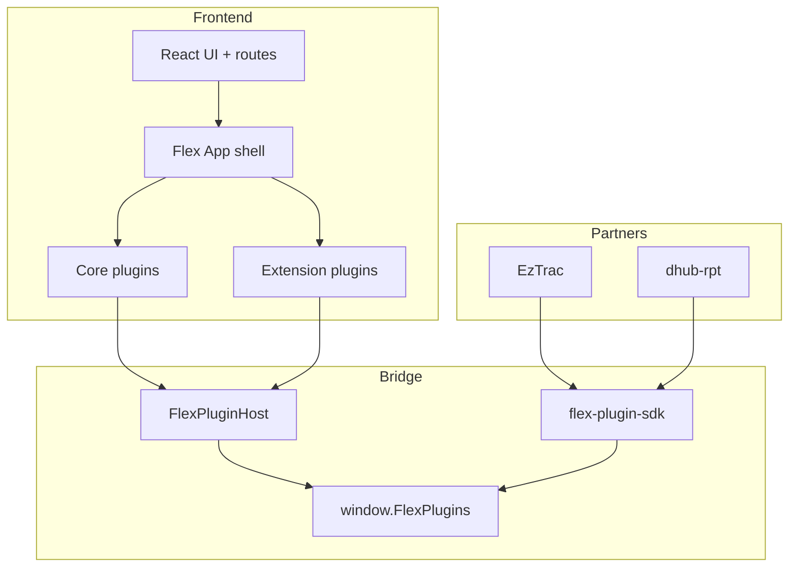

# Flex Plugin Architecture

Aligned with [Backstage architecture overview](https://backstage.io/docs/overview/architecture-overview/): **Core**, **App**, and **Plugins**.

## Terminology

| Layer | Role in Flex |
|-------|----------------|
| **Core** | Framework: plugin types, data host (`FlexPluginHost`), route bindings, browser bridge |
| **App** | `createFlexApp()` — wires core plugins + extension bundles; no feature logic |
| **Plugins** | Features: **core** (shipped, enable/disable) or **extension** (marketplace install) |

## Overview



### Plugin kinds

| Kind | IDs | Install? |
|------|-----|----------|
| Core | `flex.dashboard`, `flex.governance`, … | Always registered; disable via **Feature plugins** |
| Partner | `flex.partner.eztrac`, `flex.partner.dhub-rpt` | Contract plugins for partner apps |
| Extension | `flex.ext.*` | Install from **Tools → Plugins → Marketplace** |

## Frontend plugins (Backstage-style)

Mirrors [Building Frontend Plugins](https://backstage.io/docs/frontend-system/building-plugins/index/) without replacing `App.tsx` routes:

```tsx
import {
  createFlexFrontendPlugin,
  createPageExtension,
  createNavItemExtension,
} from './plugins/frontend';

export const myPlugin = createFlexFrontendPlugin({
  pluginId: 'flex.example',
  routes: { root: '/example' },
  extensions: [
    createPageExtension({
      pluginId: 'flex.example',
      path: '/example',
      loader: () => import('./pages/Example').then((m) => <m.Example />),
    }),
    createNavItemExtension({
      pluginId: 'flex.example',
      sectionId: 'tools',
      sectionLabel: 'Tools',
      to: '/example',
      label: 'Example',
      icon: SomeIcon,
    }),
  ],
});

// Register in createFlexApp({ features: [...CORE_FRONTEND_FEATURES, myPlugin] })
```

- **Sidebar / search / hub** are built from plugin extensions (`flexApp.getNavSections()`).
- **`App.tsx` routes stay as-is** so nothing breaks at runtime.
- **Data APIs** (`definePlugin`, `FlexPluginHost`) are unchanged.

## Source layout

```
apps/flex/src/plugins/
  frontend/               # createFlexFrontendPlugin + blueprints
    features/coreFeatures.tsx
  app/                    # App shell (Backstage "App")
    createFlexApp.ts      # Wires data plugins + frontend features
    routeBindings.ts      # Route → pluginId resolution
  corePlugins.ts          # Core plugin registry
  corePluginStore.ts      # Enable/disable core (not marketplace)
  modules/*.plugin.ts     # Core plugin implementations
  host.ts                 # FlexPluginHost — consume/produce data plane
  manager.ts              # Active plugin list (core + enabled extensions)
  marketplace/
    catalog.ts            # Extension listings only (flex.ext.*)
    bundles/              # Extension implementations only
packages/flex-plugin-sdk/ # External clients + UI PluginHost (slots)
```

## Core plugin catalog

| Plugin ID | Route | Consume | Produce |
|-----------|-------|---------|---------|
| `flex.dashboard` | `/` | KPIs, usage trend | KPI snapshot |
| `flex.governance` | `/govern/exchange` | Requests, datasets | `inbound_request` |
| `flex.settings` | `/settings` | Preferences | `preferences` |
| `flex.cloud-usage` | `/cloud` | Usage history | — |
| `flex.optimization` | `/optimization` | Savings | `advance_stage` |
| `flex.anomalies` | `/anomalies` | Events | `resolve_anomaly`, `create_anomaly` |
| `flex.chargeback` | `/chargeback` | Showback | `update_budget` |
| `flex.workforce` | `/workforce` | Squad matrix | `acknowledge_signal` |
| `flex.resources` | `/resources` | Allocation | — |
| `flex.alignment` | `/govern/alignment` | Rows | `resolve_conflict` |
| `flex.integrations` | `/govern/partners` | Apps, consumption* | sync actions |
| `flex.partner.eztrac` | `/apps/eztrac` | consumption | partner produce |
| `flex.partner.dhub-rpt` | `/apps/dhub-rpt` | consumption | partner produce |
| `flex.assistant` | `/assistant` | Knowledge | `chat_intent` |

## Marketplace extensions

| Plugin ID | Purpose |
|-----------|---------|
| `flex.ext.pagerduty` | Page on anomalies |
| `flex.ext.teams` | Teams notifications |
| `flex.ext.snowflake` | Export manifests |
| `flex.ext.jira` | Jira tickets |

Install state: `localStorage` key `flex_installed_extensions_v1` (extensions only).  
Core disable state: `flex_core_disabled_v1`.

## Browser API

```javascript
const plugins = window.FlexPlugins.catalog();
await window.FlexPlugins.consume({ pluginId: 'flex.chargeback', dataset: 'team_showback' });
```

## npm SDK

```typescript
import { createFlexPluginClient, FlexPluginIds, FLEX_PLUGIN_CHANNEL } from 'flex-plugin-sdk';
```

`flex-plugin-sdk` also exposes a Backstage-style **UI** `PluginHost` (`PluginProvider`, `Slot`) for slot-based extensions — separate from Flex’s **data** `FlexPluginHost` in the app.

## Adding an extension

1. Add `apps/flex/src/plugins/marketplace/bundles/your.plugin.ts` with `definePlugin` and `kind: 'extension'`
2. Register in `marketplace/bundles/index.ts`
3. Add listing in `marketplace/catalog.ts`

## Adding a core plugin

1. Add `apps/flex/src/plugins/modules/your.plugin.ts`
2. Export from `modules/index.ts` and register in `corePlugins.ts`
3. Add route in `App.tsx` and nav entry in `lib/navStructure.ts`
